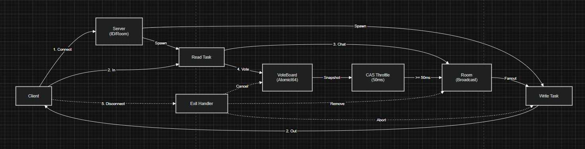

# RustChat 프로젝트 보고서

> 국민대학교 시스템최신기술 26-1 Part 2 / C조 도전과제
> Rust 기반 500인 멀티채팅 서버

## 1. 프로젝트 개요

### 1.1. 목표

Rust의 비동기 런타임 `tokio`를 기반으로 **500인 동시접속을 안정적으로 처리하는 멀티채팅 서버**를 구현합니다.
단순한 메시지 전달을 넘어, **실시간 투표 시스템**을 통해 Write-Heavy 환경에서도 Race Condition 없이 정합성을 보장함을 증명합니다.

### 1.2. 기술 스택

- **언어**: Rust (edition 2024)
- **비동기 런타임**: `tokio`
- **프레이밍**: `tokio-util` LinesCodec (`\n` 단위)
- **직렬화**: `serde` + `serde_json`
- **TUI 모니터링**: `ratatui` + `crossterm`
- **자원 모니터링**: `sysinfo`
- **테스트**: `proptest`, 통합 테스트(`tests/`)

## 2. 팀 구성 및 역할

| GitHub | 이름 | 메인 역할 | 담당 파일 |
| -------- | ------ | ------ | ------ |
| @baebea227 | 배상혁 | 서버 / 클라이언트 | `server.rs`, `client.rs` |
| @Goldbori | 선현승 | 봇 / 통합 테스트 | `bot/`, `tests/` |
| @zouea4879 | 손승완 | 메트릭 / 프로토콜 | `metrics.rs`, `protocol.rs` |
| @syeon111 | 박수연 | 방 관리 / 투표 | `room.rs`, `vote.rs`, `README.md` |

### 배상혁 @baebea227 — 서버 / 클라이언트 (Server Core)

서버 코어의 동시성 모델 설계와 안정화, race condition 추적 / 수정을 전담했습니다.

- **초기 스캐폴드 작성** — `tokio` 기반 채팅 서버 골격, 모듈 분리(`server`, `client`, `room`, `vote`, `protocol`, `metrics`, `bot`, `tui`)
- **연결 상한 강제** — `MAX_CONNECTIONS = 500` 초과 접속 거절 → 단순 카운터에서 `Arc<Semaphore>` `try_acquire_owned()` 기반으로 교체해 `load → check → add` race 제거
- **Graceful Shutdown** — SIGINT 수신 시 `BroadcastEvent::Shutdown` 전파, 클라이언트 task `JoinHandle` 전체 await, 메트릭 리포터 별도 shutdown 신호
- **투표 가시 race 차단** — `vote()`의 두 `fetch_add` 순서를 `(next +1, prev -1)`로 뒤집고 `snapshot()`에 `.max(0)` 클램프 적용 → 음수 노출 race 제거
- **종료된 client task reap** — `handles.retain(|h| !h.is_finished())`로 장기 가동 메모리 누수 방지
- **DoS 내성** — LinesCodec read 단계에서 라인 길이 강제 제한(`MAX_LINE_LEN = 65536`)
- **Disconnect 경로 보강** — disconnect 시 `VoteSnapshot` 브로드캐스트 누락 수정, `record_recv` 위치 조정 + 소켓 읽기 오류 로깅
- **봇 정합성 안정화** — fickle leader 재투표 N회 반복 + 비-리더 동기 대기로 straggler vote 누락 완화, Barrier 동기화 + fresh snapshot 트리거 도입

### 선현승 @Goldbori — 봇 / 통합 테스트 (Adversary & QA)

서버를 깨뜨리는 봇 시나리오와 통합 테스트 골격을 담당했습니다.

- **봇 혼합 모드 추가** — 한 프로세스에서 normal / fickle / spammer 등 다종 봇을 비율로 섞어 실행하는 mixed 모드
- **통합 테스트 골격 작성** — `tests/stress_test.rs` 신규 + `src/lib.rs` 노출로 binary와 테스트가 동일 모듈 공유
- **결과 리포트 출력** — 봇 측 누락률 / 정합성 PASS-FAIL 리포팅 포맷 정의
- **투표 결과 항목 추가** — 봇 측 검증 로직에 옵션별 카운트 비교 항목 추가
- **타임아웃 테스트** — `tests/recv_task_timeout_test.rs` 신규로 수신 태스크의 행 방지 보장

### 손승완 @zouea4879 — 메트릭 / 프로토콜 (Observability & Protocol)

지연·처리량 측정 인프라와 그에 필요한 프로토콜 확장을 담당했습니다.

- **Latency 측정 기준 수정** — 기존 서버 수신 시점 기준(`sent_at = now_ms()`)이 항상 ~0ms로 측정되던 버그를 수정. `ClientMsg::Chat`에 `client_ts: u64` 필드를 추가하고 클라이언트 송신 시각 기준으로 전환. `protocol.rs` / `client.rs` / `bot` / `tui.rs` 일괄 수정
- **p99 latency 측정** — `metrics.rs`에 6단 버킷 정의(`[0,1)` ~ `[100,∞)` ms), 누적 버킷 순회로 p99 근사값 계산, `MetricsSnapshot`에 `p99_latency_ms` 필드 추가
- **순간 처리량(msg/s) 측정** — 매 tick마다 recv/sent 누적값 delta로 `recv_mps` / `sent_mps` 계산해 리포터에 출력
- **README 타이틀 정리**

### 박수연 @syeon111 — 방관리 / 투표 (Room & Vote)

`Room`의 사용자 노출 메시지(Welcome / 닉네임 / VoteSnapshot)와 `protocol-room` PR 라인을 담당했습니다. 영역 경계에서 빠지기 쉬운 사용자 노출 정합성을 채웠습니다.

- **README 초안 작성** — 프로젝트 소개, 기술 스택, 테스트 전략, 실행 방법 문서화
- **Welcome 메시지** — `ServerMsg::Welcome { peer_count }` 신설, `Room::join()`이 입장 처리 후 현재 참여자 수를 반환하도록 변경. 신규 접속자가 입장 직후 자기만 받는 1회성 메시지로 현재 인원 즉시 인지 가능
- **닉네임 지원** — `ClientMsg::SetNick { name }` 추가, `ClientMeta`에 `name: Option<String>` 필드 + `Room::set_nick()` 메서드, `ServerMsg::Chat`에 `nick: Option<String>` 필드 추가 (닉네임 없으면 ID로 fallback)
- **VoteSnapshot percentages 필드** — `VoteSnapshot`에 `percentages: [f32; N_OPTIONS]` 추가, `VoteBoard::snapshot_with_percentages()` 신설로 서버에서 비율을 한 번 계산해 전송. 클라이언트 측 중복 연산 제거
- **VoteSnapshot broadcast throttle** — 500봇 환경에서 매 vote마다 broadcast가 채널을 폭주시켜 정합성 측정이 깨지는 문제를 일정 간격 throttling으로 해결
- **protocol-room PR 통합 머지** — `protocol.rs`와 `room.rs`가 동시에 손이 가야 하는 변경들을 묶어 통합 사이클 책임

## 3. 시스템 아키텍처



위 다이어그램은 클라이언트별 read/write task 분리, AtomicI64 기반 투표 집계, CAS 기반 VoteSnapshot broadcast throttle이 어떻게 연결되는지 보여 줍니다.

### 3.1. 모듈 구성

```text
src/
├── main.rs        — 진입점, CLI 파싱(clap)
├── server.rs      — TcpListener, Semaphore 기반 연결 상한 제어
├── client.rs      — per-connection 핸들러 (read/write 분리)
├── room.rs        — broadcast 채널 + 참여자 메타데이터(RwLock)
├── vote.rs        — Atomic 카운터 기반 투표 집계
├── protocol.rs    — JSON 메시지 스키마 (ClientMsg / ServerMsg)
├── metrics.rs     — 처리량/지연/누락률 측정
├── tui.rs         — 실시간 상태 대시보드
└── bot/           — 5종 봇 (normal, fickle, spammer, ghost, quitter)
```

### 3.2. 클라이언트 처리 구조 — read/write task 분리

[client.rs](../src/client.rs)에서는 `stream.into_split()`으로 TCP 스트림을 reader와 writer로 분리하고, writer 쪽은 별도 `tokio::spawn` task로 실행합니다. 덕분에 클라이언트의 송신 대기와 수신 처리가 서로를 막지 않으며, broadcast 메시지를 받는 동안에도 입력 처리가 독립적으로 진행됩니다.

이 구조는 500명 동시 접속 상황에서 특정 클라이언트의 느린 write가 read loop 전체를 지연시키는 문제를 줄여 줍니다.

### 3.3. 핵심 설계 원칙: **상태와 전달의 분리**

500명에게 메시지를 전달하는 동안 참여자 목록의 Lock을 잡고 있으면 입장/퇴장이 블로킹되어 심각한 병목이 발생합니다. 이를 해결하기 위해 다음과 같이 책임을 분리했습니다.

| 책임 | 자료구조 | Lock 전략 |
| ------ | --------- | ---------- |
| 메시지 브로드캐스트 | `tokio::sync::broadcast::Sender` | **Lock-Free** — `tx.send()` 1회로 N명에게 전달 |
| 참여자 목록 관리 | `Arc<RwLock<HashMap<u64, ClientMeta>>>` | 입장/퇴장 시에만 짧게 Write Lock 점유 |
| 투표 집계 | `[AtomicI64; N_OPTIONS]` | **Lock-Free** — `fetch_add`만 사용 |

[room.rs](../src/room.rs)에서 두 책임이 같은 구조체 `Room`에 묶여 있지만, `tx`는 broadcast 채널이고 `clients`는 RwLock으로 분리되어 서로 간섭하지 않습니다.

### 3.4. 연결 상한 제어 — Semaphore

[server.rs:32-56](../src/server.rs#L32-L56)에서 `Arc<Semaphore>`의 `try_acquire_owned()`로 연결 상한(500)을 원자적으로 강제합니다.

- `load → check → add` 분리 패턴은 race를 발생시키므로, Semaphore 한 번의 호출로 점유/거절을 결정합니다.
- 거절된 연결에는 즉시 에러 메시지를 보내고 종료합니다.
- 클라이언트 task가 패닉으로 죽어도 `_permit` drop으로 자동 반납됩니다.

## 4. 핵심 기술 이슈와 해결

### 4.1. 투표 집계의 가시 race — 음수 노출 차단

`vote(prev, next)`는 두 번의 `fetch_add` 호출로 구성됩니다. 두 호출 사이에 `snapshot()`이 끼어들면 일시적으로 카운트가 어긋납니다.

구현은 [vote.rs](../src/vote.rs)의 `counts: [AtomicI64; N_OPTIONS]` 필드를 중심으로 구성했습니다. 각 선택지 카운터를 독립적인 atomic 값으로 두고, 투표 변경 시 `fetch_add(+1)`을 먼저 수행한 뒤 이전 선택지에 `fetch_add(-1)`을 적용합니다.

**해결** ([vote.rs:21-30](../src/vote.rs#L21-L30)):

- 순서를 `(next +1, prev -1)`로 두어 옵저버가 보는 일시 상태를 항상 **over-count(과집계)** 로 만든다.
- `snapshot()`에서 `.max(0)` 클램프와 결합해 음수가 외부로 노출되는 race를 차단.
- 총합은 잠시 +1이 되었다가 회복되지만, **음수는 절대 보이지 않습니다**.

### 4.2. 변덕쟁이 봇(fickle)과 element-wise 정합성

500명이 0.01초 단위로 투표를 바꾸는 환경에서 단순 총합 비교는 의미가 없습니다. 봇이 보낸 마지막 투표 분포와 서버 집계가 **옵션별로 정확히 일치**해야 정합성이 보장됩니다.

**해결**:

- Barrier 동기화 + fresh snapshot 트리거로 측정 시점을 정렬 ([커밋 d54f16e](../#)).
- 리더 봇이 N회 재투표를 반복하고 비-리더는 동기 대기 ([커밋 a6357ae](../#)).

### 4.3. VoteSnapshot broadcast throttle

500봇 환경에서는 매 vote마다 `VoteSnapshot`을 broadcast하면 채널에 너무 많은 갱신이 몰려 정합성 측정 자체가 흔들릴 수 있습니다. 이를 막기 위해 [room.rs](../src/room.rs)의 `last_vote_broadcast_ms: AtomicU64`를 기준으로 50ms 단위 broadcast 슬롯을 둡니다.

각 vote 처리 시 현재 시각과 마지막 broadcast 시각을 비교하고, 50ms 이상 지난 경우에만 `compare_exchange`로 슬롯 선점을 시도합니다. CAS에 성공한 task만 snapshot을 전송하고, 나머지는 이미 다른 task가 최신 broadcast를 맡았다고 보고 스킵합니다. 이 방식은 별도 lock 없이 broadcast 빈도를 제한하면서도 최신 상태 전파는 유지합니다.

### 4.4. 종료된 task 핸들 reap

장기 가동 시 `tokio::spawn`으로 만든 핸들이 누적되면 메모리 누수의 원인이 됩니다.
[server.rs:72](../src/server.rs#L72)에서 매 accept 마다 `handles.retain(|h| !h.is_finished())`로 회수합니다.

### 4.5. DoS 내성 — 라인 길이 제한

LinesCodec read 단계에서 라인 길이를 강제 제한해 거대한 입력으로 메모리를 고갈시키는 공격을 차단합니다 ([커밋 faabcb1](../#)). `MAX_LINE_LEN = 65536`바이트.

### 4.6. Disconnect 시 VoteSnapshot 누락

기존 코드는 클라이언트 disconnect 시 unvote만 수행하고 스냅샷 브로드캐스트를 하지 않아, 다른 클라이언트는 변경을 인지하지 못했습니다. [커밋 2cca813](../#)에서 disconnect 경로에도 스냅샷 송신을 추가했습니다.

### 4.7. Graceful Shutdown

- SIGINT 수신 시 `BroadcastEvent::Shutdown`을 모든 클라이언트에 전파.
- 서버는 미완료 클라이언트 task의 `JoinHandle`을 모두 await ([커밋 34dfbad](../#)).
- 메트릭 리포터 태스크도 별도 shutdown 신호로 정리 ([커밋 6079e07](../#)).

## 5. 테스트 전략

### 5.1. 봇 5종

| 봇 | 목적 | 검증 항목 |
| ---- | ------ | --------- |
| normal | 일반 채팅 부하 | 누락률 0% |
| fickle | 변덕쟁이 투표 | 옵션별 정합성 |
| spammer | 도배 공격 | 서버 크래시 없음 |
| ghost | 잠수 클라이언트 | 메모리 누수 없음 |
| quitter | 비정상 종료 | 서버 패닉 없음 |

### 5.2. 통합 테스트

- [tests/stress_test.rs](../tests/stress_test.rs) — 500인 부하
- [tests/recv_task_timeout_test.rs](../tests/recv_task_timeout_test.rs) — 수신 task 타임아웃

### 5.3. Property-based Testing

`proptest` 1.x를 dev-dependency로 도입하여, 무작위 입력에 대한 invariant 검증을 가능하게 합니다.

## 6. 메트릭

[metrics.rs](../src/metrics.rs)에서 다음 지표를 수집합니다.

- **처리량**: 초당 메시지 수 (MPS)
- **지연 시간**: `client_ts` echo 기반 — 발신자 RTT를 정확히 측정 (이전엔 wall-clock 기반이었으나 시계 차이로 부정확하여 제거됨, [커밋 4fb4c54](../#))
- **누락률**: 봇 ID + 시퀀스 번호 매칭

## 7. GitHub 협업 흔적

- 총 42 커밋
- PR 기반 머지 (예: PR #8 protocol-room 머지)
- 브랜치 전략: feature 브랜치 → main 머지
- 커밋 컨벤션: `fix(scope): 한글 설명 — 보충`

## 8. 결론

Rust의 `tokio` 비동기 런타임을 기반으로 **500인 동시접속 멀티채팅 서버**를 성공적으로 구현했습니다.

핵심 목표였던 **동시성 정합성**은 read/write task 분리, Lock-Free 상태 관리, atomic 기반 투표 집계를 조합해 달성했습니다. 메시지 전달은 `broadcast::Sender`로 Lock 없이 처리하고, 연결 상한은 `Arc<Semaphore>`로 원자적으로 강제하며, 투표 집계는 `[AtomicI64; N_OPTIONS]`와 fetch_add 순서 보장으로 음수 노출 race를 원천 차단했습니다. 또한 CAS 기반 `VoteSnapshot` broadcast throttle로 고빈도 투표 상황에서도 갱신 폭주를 완화했습니다.

5종 봇(normal / fickle / spammer / ghost / quitter)으로 구성한 통합 테스트에서 **element-wise 투표 정합성 PASS**와 **채팅 누락률 0%** 를 확인했습니다. Rust의 타입 시스템과 소유권 모델이 설계 단계에서 다수의 race condition 가능성을 컴파일 타임에 제거해 주었고, 이는 고부하 환경에서 서버 안정성으로 직결되었습니다.

## 9. 회고

[RETROSPECTIVE.md](./RETROSPECTIVE.md) 참조
